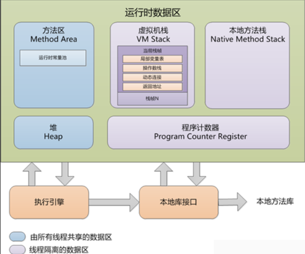

# 2.1 概述
Java程序员把内存控制的权利交给了Java虚拟机，一旦出现内存泄漏和溢出方面的问题，如果不了解虚拟机是怎么样使用内存的，那么排查错误将会是一项异常艰难的工作。
本章将从概念上介绍Java虚拟机内存的各个区域，讲解这些区域的作用、服务对象以及可能产生问题，这是翻越虚拟机内存管理这堵围墙的第一步

# 2.2 运行时数据区域
Java虚拟机在执行Java程序的过程中会把它所管理的内存划分为若干个不同的数据区域。这些区域都有各自的用途，以及创建和销毁的时间，有的区域随着虚拟机进程的启动而存在，有些区域则依赖用户线程的启动而建立和销毁。根据《Java虚拟机规范(Java SE 7版)》的规定，Java虚拟机所管理的内存将会包括以下几个运行时数据区域,如下图所示  
  
## 2.2.1 程序计数器
程序计数器(Program Counter Register)是一块较小的内存空间，它可以看作是当前线程所执行的字节码的行号指示器。在虚拟机的概念模型里(仅是概念模型，各种虚拟机可能会通过一些更高效的方式来实现)，字节码解释器工作时就是通过改变这个计数器的值来选取下一条需要执行的字节码指令，分支、循环、跳转、异常处理、线程恢复等基础功能都需要依赖这个计数器来完成。
由于Java虚拟机的多线程是通过线程轮流切换并分配处理器执行时间的方式来实现的，在任何一个确定的时刻，一个处理器都只会执行一条线程中的指令。因此，为了线程切换后能恢复到正确的执行位置，每条线程都需要一个独立的程序计数器，各条线程之间计数器互不影响，独立存储，我们称这类内存区域为“线程私有”的内存。
如果线程正在执行一个Java方法，这个计数器记录的是正在执行的虚拟机字节码指令的地址；如果正在执行的Native方法，这个计数器值作为为空(Undefined)。此内存区域是唯一一个在Java虚拟机规范中没有规定OutOfMemoryError情况的区域。
  
## 2.2.2 java虚拟机栈
与程序计数器一样，Java虚拟机栈(Java Virtual Machine Stacks)也是线程私有的，它的生命周期与线程相同。虚拟机栈描述的是Java方法执行的内存模型：每个方法在执行的同时创建一个栈帧(Stack Frame)用于存储局部表量表、操作数栈、动态链接、方法出口等信息。每个方法从调用直至执行完成的过程，就对应着一个栈帧在虚拟机栈中从入栈到出栈的过程。
局部变量表存放了编译期可知的各种基本数据类型(boolen、byte、char、short、int、float、long、double)、引用类型和returnAddress类型(指向了一条字节码指令的地址)。
其中64位长度的long和double类型的数据会占用2个局部变量空间(Slot)，其余的数据类型只占用1个。局部变量表所需的内存空间在编译期间完成分配，当进入一个方法时，这个方法需要在帧中分配多大的局部变量空间是完全确定的，在方法运行期间不会改变局部变量表的大小。
在Java虚拟机规范中，对这个区域规定了两种异常状况：如果线程请求的栈深度大于虚拟机所允许的深度，将抛出StackOverflowError异常；如果虚拟机栈可以动态扩展，扩展时无法申请到足够的内存，就会抛出OutOfMemoryError异常。

## 2.2.3 本地方法栈
本地方法栈(Native Method Stack)与虚拟机栈所发挥的作用是非常相似的，它们之间的区别不过是虚拟机栈尾虚拟机执行Java方法(也就是字节码)服务，而本地方法栈则为虚拟机使用到的Native方法服务。在虚拟机规范中对本地方法栈中方法使用的语言、使用方式与数据结构并没有强制规定不过，因此具体的虚拟机可以自由实现它。甚至有的虚拟机直接把本地方法栈和虚拟机栈合二为一。与虚拟机栈一样，本地方法栈区域也会抛出StackOverflowError和OutOfMemoryError异常。

## 2.2.4 java堆 
对于大多数应用来说，Java堆(Java Heap)是Java虚拟机所管理的内存中最大的一块。Java堆屎被所有线程共享的一块内存区域，在虚拟机启动时创建。此内存区域的唯一目的就是存放对象实例，几乎所有的对象实例都在这里分配内存。这一点在Java虚拟机规范中的描述是：所有的对象实例以及数组都在堆上分配，但是随着JIT编译器的发展与逃逸分析技术逐渐成熟，在栈上分配、标量替换优化技术将会导致一些微妙的变化，所有的对象都分配在堆上也渐渐变得没那么绝对了。
## 2.2.5 方法区

## 2.2.6 运行时常量池

## 2.2.7 直接内存
